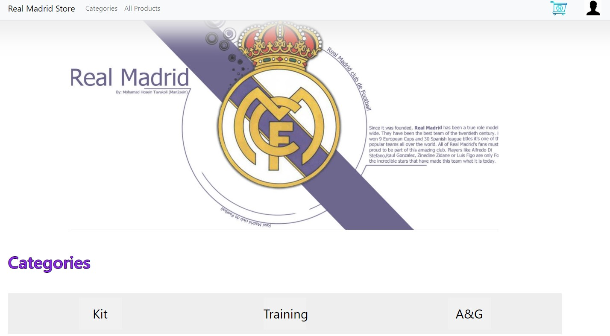
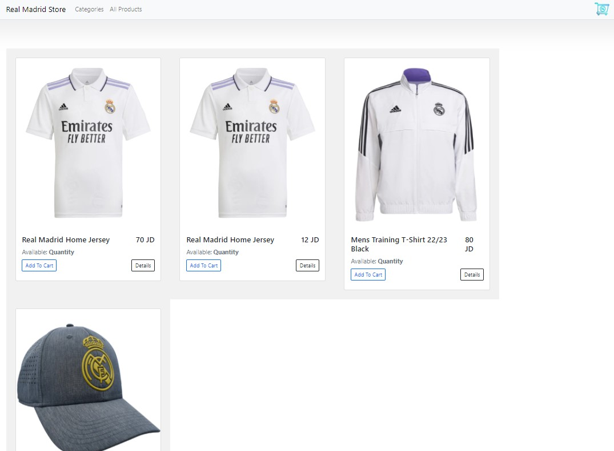
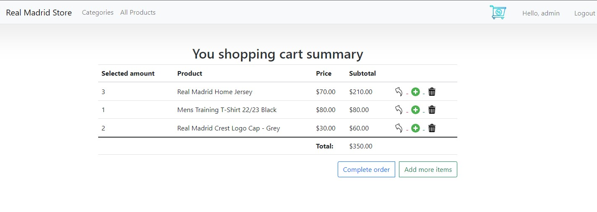

# Real Madrid Store

A website that allows customers to buy and sell ```Real-Madrid``` goods. Customers can select to display products in a single category. Customers can click on any product to get more information including pricing. Customers can select items and add them to their shopping cart

## Live Demonstration

The E-commerce demo can be viewed online [HERE](https://realmadridstore.azurewebsites.net/)

<br>

<b>Category Features</b>

| Feature  |  Coded?       | Description  |
|----------|:-------------:|:-------------|
| Add a Cart | &#10004; | Ability of Add New Cart |
| List Categories | &#10004; | Ability of List Categories |
| Edit a Category | &#10004; | Ability of Edit a Category |
| Delete a Category | &#10004; | Ability of Delete a Category |


<b>Products Features</b>

| Feature  |  Coded?       | Description  |
|----------|:-------------:|:-------------|
| Add a Product | &#10004; | Ability of Add a Product on the System |
| List Products | &#10004; | Ability of List Products |
| Edit a Product | &#10004; | Ability of Edit a Product |
| Delete a Product | &#10004; | Ability of Delete a Product |
| Product to Category | &#10004; | Ability to Add a Product to a Specific Category|
| Product from Category | &#10004; | Ability to Remove a Product from a Specific Category|

<b>Cart Features</b>

| Feature  |  Coded?       | Description  |
|----------|:-------------:|:-------------|
| Create a Cart | &#10004; | Ability of Create a new Cart |
| See Cart | &#10004; | Ability to see the Cart and it items |
| Add Item | &#10004; | Ability of add a new Item on the Cart |
| Remove a Item | &#10004; | Ability of Remove a Item from the Cart |
| Checkout | &#10004; | Ability to Checkout |
| Email Send| &#10004; | An Email will be sent on a checkout |

<br>

Here are screenshots that show the E-commerce demo application in use.

## Home Page
---

<br>

## Products Page
---

<br>

## Cart Page
---

<br>

## Getting Started
To get started you can simply clone this ecommerce-demo repository and install the dependencies.

Clone the ecommerce-demo repository using git:

```bash
git clone https://github.com/hmza-smha/RealMadridStore.git
cd RealMadridStore
```

## Tech Stack
- ASP.NET core MVC
- Entity Framework
- HTML, CSS, Javascript, bootstrap
- Azure
